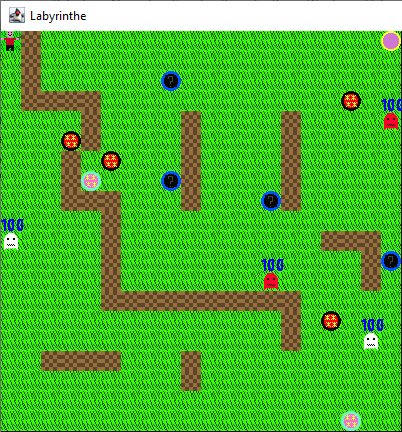

# Pacman_VYBA

`Pacman_VYBA ` is a labyrinth game developed with Java.




## Installation
### Prerequisites
```bash
You need [Maven](https://maven.apache.org/) to run this game or Eclipse
```

## How to run the project
```bash
mvn compile
mvn exec:java -Dexec.mainClass=VYBA.principal
or exceute the principal class in Eclipse
```

## How to play
```bash
Tap Up : to move up
Tap Down : to move down
Tap Left: to move left
Tap Right : to move right
Tap space : to attack 
```


## Authors
```bash
Mehdi Yahyaoui
Mohamed Bougaba
Mohamed Afkir
Paul Vincent
Youness Lifsal
```


